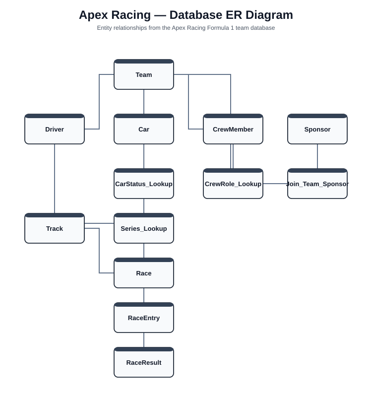

# Apex Racing — Formula 1 Team Database

A relational database project built with **Microsoft SQL Server** and **T-SQL** to model the core operations of a Formula 1 racing team.

The system manages teams, drivers, crew members, cars, sponsors, tracks, race events, race entries, and race results. It was designed from an ER model and implemented with relational constraints, sample data, reusable views, and stored procedures.

## Project Highlights

- Designed a **13-table relational database**
- Built a physical **Crow's Foot ER model**
- Used primary keys, foreign keys, lookup tables, and a many-to-many junction table
- Implemented GUID-based identifiers with `UNIQUEIDENTIFIER`
- Added realistic test data for racing operations
- Created **8 SQL views** using joins, filters, nested queries, and outer joins
- Created **5 stored procedures** for reporting, updates, maintenance, and dependent-record deletion
- Used soft-delete/status fields for operational data
- Built race reporting across drivers, cars, tracks, entries, and results

## Technologies

- Microsoft SQL Server
- T-SQL
- SQL Server Management Studio
- Relational Database Design
- ER Modeling
- draw.io

## ER Diagram



The editable diagrams.net source is also included at `docs/apex-racing-er-diagram.drawio`.

## Database Structure

The database includes the following main entities:

`Team` · `Driver` · `CrewMember` · `Car` · `Sponsor` · `Track` · `Race` · `RaceEntry` · `RaceResult`

Supporting lookup and relationship tables include:

`CrewRole_Lookup` · `CarStatus_Lookup` · `Series_Lookup` · `Join_Team_Sponsor`

## SQL Features Demonstrated

- `CREATE TABLE`
- Primary and foreign key constraints
- `INNER JOIN` and `LEFT OUTER JOIN`
- Nested queries
- Views
- Stored procedures
- Parameters
- `INSERT`, `UPDATE`, and `DELETE`
- Default values
- GUID generation with `NEWID()`
- Referential integrity

## Stored Procedures

The project includes procedures to:

1. Retrieve a driver's complete race history
2. Update a race car's status
3. Build a race-report summary table
4. Deactivate sponsors with expired contracts
5. Delete a driver's dependent race records while respecting foreign-key relationships

## Repository Structure

```text
apex-racing-database/
├── README.md
├── database/
│   ├── setup.sql
│   ├── views.sql
│   ├── stored-procedures.sql
│   └── tests.sql
└── docs/
    └── Apex_Racing_CIS245_Final.pdf
```

## Full Project Documentation

The complete project report, including the database design, data dictionary, SQL implementation, views, and stored procedures, is available here:

[View the full project PDF](docs/Apex_Racing_CIS245_Final.pdf)

## About

This project was originally developed as a database-design project and has been organized here as a software/database portfolio project.

**Author:** Vatsal Sagar
